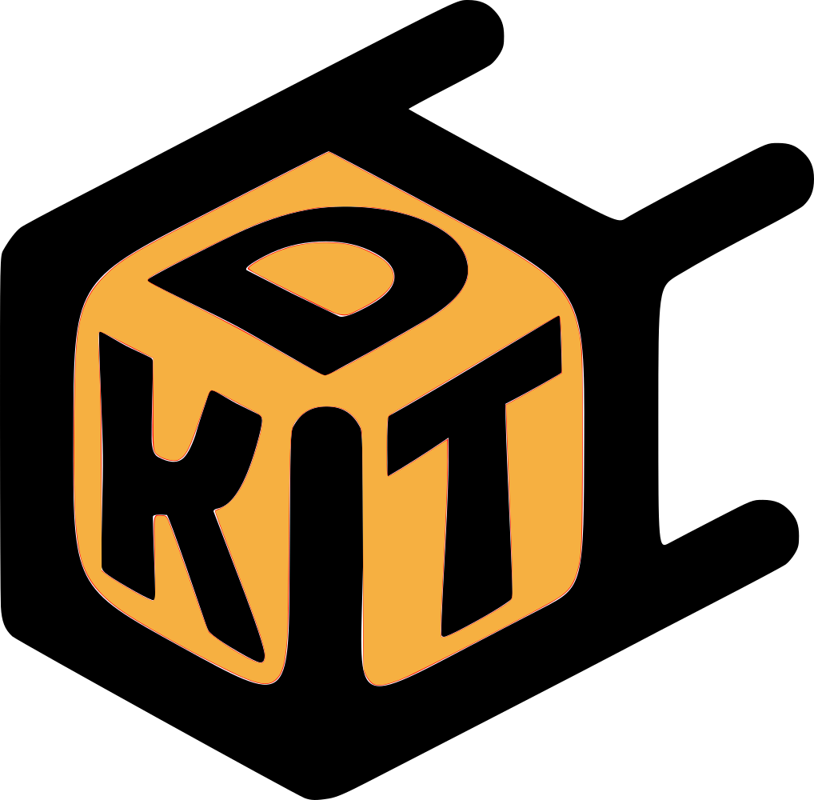

# KDT - App 🚀

 
KDT es una **app mobile** que permite conectar mensajeros o cadetes con particulares que necesitan hacer **envíos locales** o completar **mandados** y no pueden realizarlos personalmente.  

La aplicación está diseñada para:  
- Facilitar la comunicación entre clientes y mensajeros.  
- Permitir la gestión de pedidos en tiempo real, desde la solicitud hasta la entrega.   
- Brindar un registro histórico de mandados y envíos para clientes y mensajeros.  

---
## 📋 Requisitos previos
- Backend funcionando (https://github.com/MarranoLuna/KDT)
- Ionic CLI
  - ` npm install -g @ionic/cli `

---
## ⚡ Instalación

1. Clonar el repositorio
2. Asegurarse de que el backend está corriendo
3. Instalar dependencias
   - `npm install`
4. Levantar app
   - En la raiz del proyecto ejecutar: `ionic serve`
   - La app se abre en el navegador de forma automática, sino se puede acceder en http://localhost:8100
5. Para una mejor experiencia, presionar F12 para activar DevTools y luego `Ctrl` + `shift` + `M` para mostrar la vista como en los dispositivos móviles.

---
